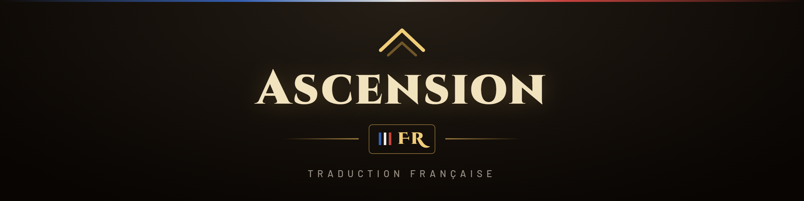

  

  <b>La traduction française complète pour <a href="https://ascension.gg">Project Ascension</a></b> 
  Quêtes, objets, sorts, dialogues, interface, écran de création… le jeu enfin dans ta langue.

  <a href="../../releases/latest"><b>⬇️ TÉLÉCHARGER LA DERNIÈRE VERSION</b></a>
  &nbsp;·&nbsp;
  <a href="https://discord.gg/kFJGDJbeay"><b>💬 Discord</b></a>

---

## 📥 Installation — deux façons, au choix

| | 🖥️ **Avec le Compagnon** | 📁 **À la main** |
|---|---|---|
| Pour qui | ceux qui veulent le plus simple | ceux qui préfèrent ne rien exécuter |
| Comment | double-clic, un bouton | extraire un zip |
| Mises à jour | **en un clic** (et l'appli se met à jour toute seule) | re-télécharger le zip |
| Signaler un souci | **un bouton, ça part tout seul** | copier-coller sur le Discord |

### 🖥️ Avec le Compagnon (le plus simple)

1. **[Télécharge `AscensionFR_Compagnon.exe`](../../releases/latest)** et
   pose-le où tu veux (bureau, dossier du jeu…).
2. Double-clique dessus : il **trouve ton jeu tout seul**.
3. Clique sur **« Installer la traduction »**. C'est fini. 🎉

> 🛡️ Au premier lancement, Windows peut afficher un écran bleu « Windows a
> protégé votre ordinateur » : c'est le lot de tout programme non signé d'un
> petit projet. Clique **« Informations complémentaires » → « Exécuter quand
> même »**. Le [code source est public](compagnon/) si tu veux vérifier ce
> qu'il fait.
>
> 🔐 Si ton jeu est dans `C:\Program Files`, Windows protège ce dossier :
> le Compagnon te proposera un bouton **« Relancer en administrateur »**,
> accepte et tout se déroulera normalement.

### 📁 À la main (2 minutes, que des fichiers)

C'est une traduction : rien que des fichiers d'addon (`.lua` / `.xml`), du
texte que tu peux ouvrir et lire. **Aucun programme à installer, aucun `.exe`.**

1. **[Télécharge `AscensionFR_manuel.zip`](../../releases/latest).**
2. **Extrais-le dans le dossier de ton jeu Ascension** — celui qui contient
   déjà un dossier `Interface` (souvent `…\resources\ascension-live`).
   Windows te demande de **fusionner le dossier `Interface`** → dis **oui**
   (ça n'efface aucun de tes autres addons, ça ajoute les nôtres à côté).
3. Lance le jeu jusqu'à l'écran de **sélection des personnages**. En bas à
   gauche, clique sur **« AddOns »**, coche **« Load Out of Date AddOns »**
   (charger les AddOns périmés) en haut, vérifie qu'**AscensionFR** est
   coché, puis **Applique**.
4. Connecte-toi. **C'est en français !** 🎉

> ✅ Tu dois obtenir `Interface\AddOns\AscensionFR`,
> `Interface\AddOns\AscensionFR_Repliques` et `Interface\PTRXML`.
> L'extraction place tout au bon endroit toute seule.
>
> 💡 Le bouton **« AddOns »** à la sélection des personnages est la méthode
> qui marche à tous les coups. Inutile de chercher une case dans le lanceur :
> selon les versions elle change de nom ou n'existe pas.
>
> 🔄 **Déjà une version installée ?** Extrais simplement le nouveau zip
> par-dessus (dis « oui » pour remplacer les fichiers), puis `/reload` en jeu
> ou reconnecte-toi. Tes réglages sont conservés.

## 🖥️ Ce que fait le Compagnon

Une petite application **optionnelle** — l'installation manuelle marche
toujours, le Compagnon est un plus, jamais une obligation.

- **Installe et met à jour la traduction** en un clic, avec la progression
  affichée.
- **Se met à jour lui-même** : quand une nouvelle version sort, un clic et il
  se remplace puis redémarre tout seul.
- **Envoie ton rapport de contribution** en un clic — plus besoin de copier
  quoi que ce soit (le bouton « copier » reste là si tu préfères).
- **Affiche l'état de ta traduction** : nombre de textes français actifs sur
  ton jeu, et ce que ton rapport contient.

> 🔍 **Transparence** : [code source ouvert](compagnon/) — un seul fichier
> Python lisible, avec la recette exacte pour reconstruire l'`.exe` toi-même.
> Le rapport ne contient **que des textes du jeu** et des numéros de
> sorts/objets : jamais d'information personnelle.

## ✅ Ce qui est traduit

- **Quêtes** — titres, objectifs, descriptions, récompenses
- **Objets** — noms, descriptions, effets (« Utiliser : … »)
- **Sorts, talents, buffs et débuffs** — noms et info-bulles, valeurs comprises
- **Interface** — menus, boutons, fenêtres, info-bulles
- **Écran de création** — races, classes, fiches techniques, rôles
- **Dialogues et paroles des PNJ** dans le chat
- **Créatures, métiers, zones** et le contenu custom d'Ascension

## ⚙️ Comment ça marche

Ascension FR est un **simple addon** — le système officiellement autorisé par
Ascension. Il remplace à l'affichage les textes anglais par leur version
française, à partir de bases de données livrées avec l'addon.

- **Aucun fichier du jeu n'est modifié.** L'installation ne fait qu'ajouter
  des fichiers d'addon. C'est **100 % réversible** : supprime les dossiers et
  tout redevient comme avant.
- **Sans risque.** Pas de modification du client, pas de contournement —
  juste de l'affichage traduit.
- **Un texte reste en anglais ?** Le jeu est immense : c'est possible. Tout
  le reste continue de fonctionner. En jeu, tape `/afr` pour le panneau de
  la traduction.

## 🤝 Aider la traduction (10 secondes)

Le jeu est immense — impossible de tout traduire seul. Alors **l'addon note
tout seul** les textes encore en anglais que tu croises pendant que tu joues.
Il ne reste qu'à les envoyer :

**Avec le Compagnon** — déconnecte-toi (ou tape `/reload`), ouvre le
Compagnon, clique sur **« Envoyer mon rapport »**. C'est tout. ✅

**Sans le Compagnon** — en jeu, `/afr` → onglet **« Aider la traduction »** →
**« Copier mon rapport »** → colle-le sur le
[Discord](https://discord.gg/kFJGDJbeay).

Chaque classe et chaque zone que tu joues font avancer la traduction pour
**tout le monde**. Les rapports reçus sont traduits et intégrés à la version
suivante. 💜

## 💡 Pourquoi ce projet

Ascension proposait un pack de langue français, mais il a été **retiré car il
causait des bugs**. Je voulais jouer dans ma langue — alors je l'ai refait
moi-même, proprement : chaque traduction passe par un contrôle qui **refuse
tout ce qui pourrait casser le jeu** (c'est justement ce qui plantait avant).

Le résultat est là, gratuit, et je continue de l'améliorer au fil des parties.

## ❓ FAQ

**Je peux être banni ?** Non. C'est un addon, autorisé par Ascension, qui ne
touche à aucun fichier du jeu.

**Ça marche sur la dernière version d'Ascension ?** Oui. En cas de gros patch,
une nouvelle version est publiée ici.

**Comment désinstaller ?** Supprime les dossiers `AscensionFR` et
`AscensionFR_Repliques` dans `Interface\AddOns`, et `PTRXML` dans `Interface`.

**Un texte est faux ou en anglais ?** Envoie ton rapport (voir « Aider la
traduction » plus haut) ou ouvre une [issue](../../issues) — chaque retour
améliore la suite.

**Le Compagnon est-il obligatoire ?** Non. L'installation manuelle marche
exactement pareil, et rien n'est jamais bloqué derrière l'application.

**Le Compagnon envoie-t-il mes données ?** Non. Il ne contacte que GitHub
(pour les mises à jour) et, si tu cliques sur « Envoyer mon rapport », le
salon Discord du projet — avec **uniquement** des textes du jeu et des
numéros de sorts/objets. Rien d'automatique, rien de personnel : le
[code source](compagnon/) le montre.

**Windows dit que le Compagnon est dangereux ?** C'est SmartScreen : il alerte
sur tout programme non signé d'un petit projet (un certificat coûte plusieurs
centaines d'euros par an). « Informations complémentaires » → « Exécuter quand
même ». Si tu préfères, l'installation manuelle ne demande **aucun**
programme.

## 💛 Soutenir le projet

La traduction est **gratuite** et le restera — rien n'est jamais bloqué
derrière un don. Mais si elle te plaît et que tu veux soutenir le temps passé
(et les mises à jour à venir), tu peux offrir un café. C'est totalement
optionnel, et ça aide à garder la motivation. 🙏

  <a href="https://buymeacoffee.com/lepetitdan"><b>☕ M'offrir un café — Buy Me a Coffee</b></a>

---

Projet communautaire <b>non officiel</b>, sans affiliation avec Blizzard
Entertainment ni Project Ascension. Aucun fichier du jeu n'est redistribué :
l'addon ne contient que des fichiers de traduction. Fait par un joueur, pour
les joueurs. 💜

